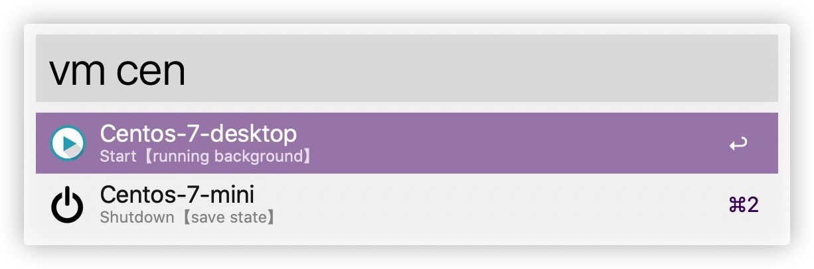

## VM-Manager
You can start or shutdown you VirtualBox easily.

## Start Machine
Select the VM with start icon and Click enter, the VM will running background by default. You can press Cmd Key ⌘ or Alt Key ⌥ to choice other running mode.

## Close Machine
Same as Start，You can also press Cmd Key ⌘ or Alt Key ⌥ to choice other close way.

## Search Machine
As you see in the picture, you can input keywords to find the machine quickly and it will return the result which sorting by the usage. It mean's that the recent used machine will be at the front.

## Other Function
Use `⌘+C`，you can copy the command like "VBoxManage startvm Centos-7-desktop --type headless"。And you can use `⌘+L` to see the command.